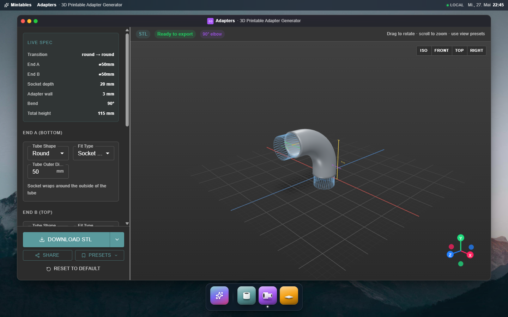
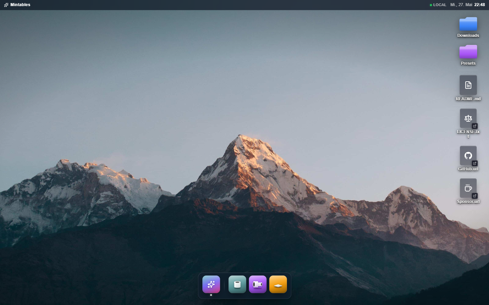
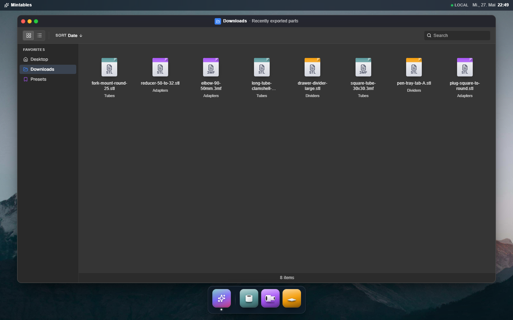
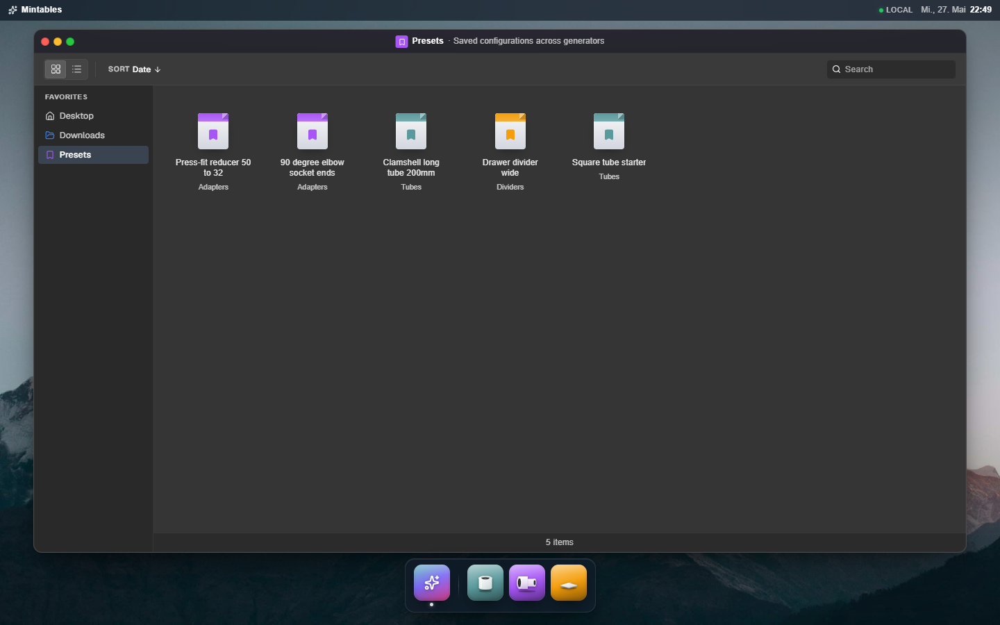
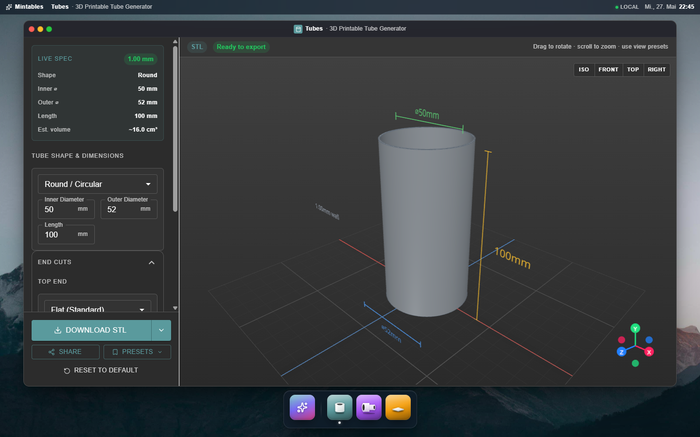
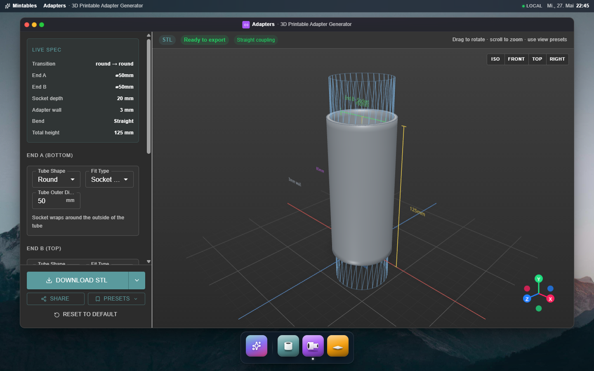
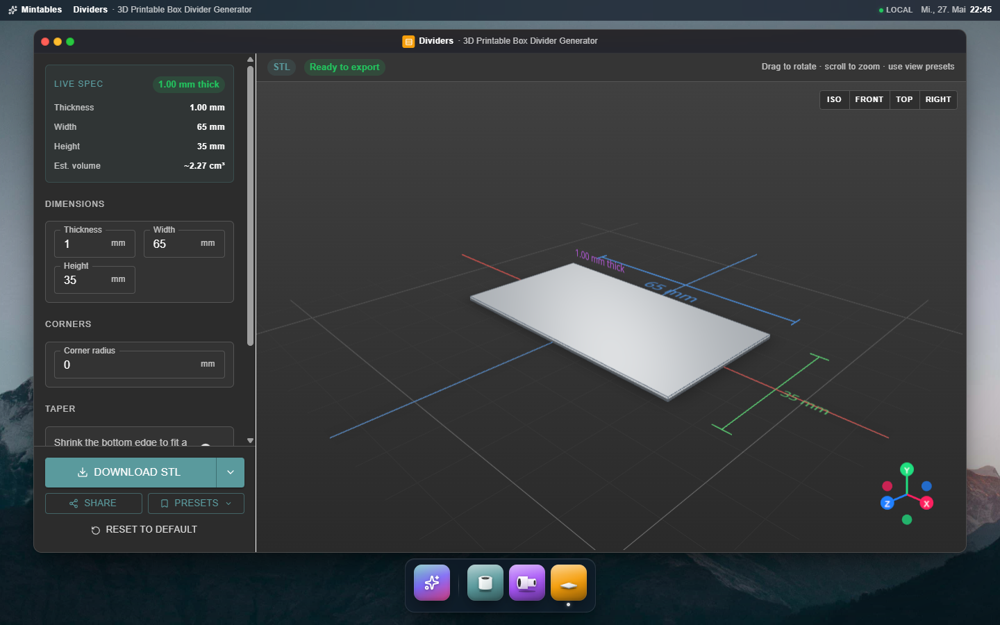

# Mintables

<p align="center">
  <strong>Parametric 3D generators for makers. Designed in the browser, exported as STL or 3MF.</strong>
</p>

<p align="center">
  <a href="https://github.com/saschb2b/mintables/blob/main/LICENSE">
    
  </a>
  <a href="https://buymeacoffee.com/qohreuukw">
    
  </a>
</p>

<p align="center">
  
</p>

Mintables is a monorepo of browser-based, parametric design tools for 3D-printable parts. Each generator plugs into a shared **OS-style desktop shell** (wallpaper, dock, floating windows) so every tool gets the same sidebar, live 3D preview, and validated export.

---

## The desktop

Open Mintables and you land on a desktop, not a webpage. Apps live in the dock at the bottom. System shortcuts (README, license, GitHub, sponsor) sit on the right edge like files. Folders for **Downloads** and **Presets** appear automatically once you've created some.

<p align="center">
  
</p>

Every generator opens as a window with macOS-style traffic lights: close, minimize (with a genie effect toward its dock tile), and a maximize / restore toggle.

---

## Folders earn their place

The desktop stays empty until you create state. Export your first part and a **Downloads** folder appears on the right edge. Save your first preset and a **Presets** folder appears next to it. Open either and you get a Finder-style window with a view toggle, sort, search, multi-select (Shift / Cmd-click), F2 to rename, and a right-click context menu.

### Downloads

Every export is recorded with generator id, filename, format, the exact config you used, and a timestamp. The binary file itself isn't stored: re-running the export on demand is cheap and means presets always reflect today's geometry code, not yesterday's.

<p align="center">
  
</p>

### Presets

Save any configuration with a name and it shows up here, across every generator, sorted newest-first. Double-click to open the configuration back in its generator with one click.

<p align="center">
  
</p>

Both folders share the same `FileExplorer` component and a left **Favorites** rail that lets you jump between Desktop, Downloads, and Presets without going back to the hub.

---

## Generators

### Tubes

Round, square, and rectangular tubes with flat / miter / chamfer / saddle end cuts, press-fit flares with optional lead-in chamfer, stop shoulder, and anti-rotation key, and a clamshell split for printing long round tubes as two interlocking halves.

<p align="center">
  
</p>

### Adapters

Press-fit connectors that bridge any two tubes. Round / square / rectangular ends in any combination, socket (wraps the tube) or plug (slides inside) fittings, straight couplings or up to 90° elbows with auto-calculated bend radius. Ghost geometry shows where the mating tubes go.

<p align="center">
  
</p>

### Dividers

Flat printable slabs: thickness × width × height with optional rounded corners, taper, and a labeled pocket aligned top / center / bottom. The honest building block when you just need a stiff rectangle.

<p align="center">
  
</p>

---

## Shared platform

- **Real-time 3D preview**: professional CAD-style metallic rendering, dimension indicators, view presets (Iso / Front / Top / Right), orbit controls, ghost geometry where relevant
- **Validated export**: degenerate-triangle check before download; clear error banner when dimensions can't print
- **Share links**: every generator's full configuration encodes into the URL
- **Local presets**: save and reload configurations from your browser
- **STL and 3MF** with millimeter units preserved in 3MF

---

## Repo layout

```
apps/studio/            Next.js shell. Single app, /generators/<id> routes
packages/shared/        @mintables/shared. Generator contract + app shell
packages/generators/    One package per generator (tubes, adapters, dividers, …)
```

See [`CLAUDE.md`](./CLAUDE.md) for the full architecture, the generator contract, and how to add a new generator.

---

## Getting started

```bash
git clone https://github.com/saschb2b/mintables.git
cd mintables
pnpm install
pnpm dev
```

Open [http://localhost:3000](http://localhost:3000), pick a generator from the dock, or jump straight to `/generators/tubes`, `/generators/adapters`, or `/generators/dividers`.

---

## Tech stack

- **Next.js 16** + **React 19** + **TypeScript** (App Router, Turbopack)
- **Material UI v7** for UI components and the dark theme
- **React Three Fiber** + **Three.js** for 3D rendering
- **Turborepo** + **pnpm workspaces** for monorepo orchestration
- **Vitest** for per-package unit tests (mesh generation, validation, decode round-trips)

---

## Development

```bash
pnpm install
pnpm dev              # studio dev server
pnpm test             # vitest across all packages
pnpm typecheck        # tsc across all packages
pnpm lint
pnpm build            # production build
```

---

## License

MIT. See [LICENSE](./LICENSE).
